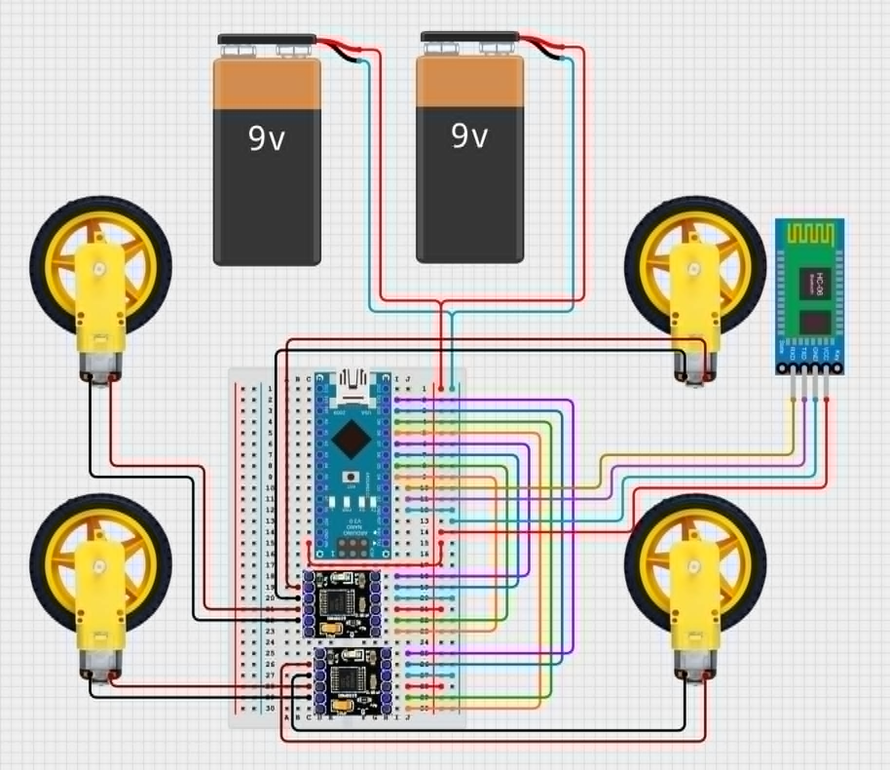
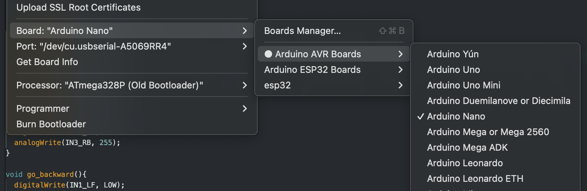

# Arduino Remote-Controlled Car with Dabble App

## Description

- A remote RC car controlled by Dabble App using Dabble Arduino Library.
- Using bluetooth communication to control with your phone.
- Cheap and easy to build.
- Powered by battery or battery bank.

## Images

## Demo video

[Youtube](https://www.youtube.com/watch?v=myx7Zmuy4rU)

## Circuit diagram

## CAD sketch

Please see [car_parts](/cad_parts/) folder to get STL

## Bill of Materials

| Component                                 | Source                                                                                                   | Quantity | Unit Cost | Cost    |
| ----------------------------------------- | -------------------------------------------------------------------------------------------------------- | -------- | --------- | ------- |
| Arduino Nano (type C port)                | [Link](https://hshop.vn/mach-nano-ch340-cong-usb-c-arduino-nano-compatible)                              | 1        | 75,000    | 75,000  |
| Module Bluetooth 3.0 SPP / BLE 4.2 JDY-33 | [Link](https://hshop.vn/mach-thu-phat-bluetooth-dual-mode-3-0-spp-ble-4-2-jdy-33-hc-05-hc-06-compatible) | 1        | 59,000    | 59,000  |
| DC deceleration motors + wheels           | [Link](https://hshop.vn/dong-co-dc-giamtoc-v1-1-48)                                                      | 4        | 18,000    | 36,000  |
| DC Mini DRV8833 motor controller          | [Link](https://hshop.vn/mach-dieu-khien-dong-co-dc-mini-drv8833)                                         | 2        | 15,000    | 30,000  |
| Breadboard MB-102 400 holes 85x55x10mm    | [Link](https://hshop.vn/test-board-camnho-8-5-x-5-5-cm)                                                  | 1        | 16,000    | 16,000  |
| Base                                      | 3D printed                                                                                               | 1        | n/a       | n/a     |
| Racket                                    | 3D printed                                                                                               | 2        | n/a       | n/a     |
| Base                                      | 3D printed                                                                                               | 1        | n/a       | n/a     |
| Nuts and Bolts (short)                    | On-hand                                                                                                  | 8        | n/a       | n/a     |
| Nuts and Bolts (long)                     | On-hand                                                                                                  | 8        | n/a       | n/a     |
| Two-sided tape                            | On-hand                                                                                                  | 1        | n/a       | n/a     |
| 9v battery                                | Idk department stores or stationaries                                                                    | 2        | ~15,000   | ~30,000 |
| 9V battery connector                      | [Link](https://hshop.vn/giac-pin-vuong-9v)                                                               | 2        | 2,000     | 4,000   |
| 2.54mm male pin header 1x40               | [Link](https://hshop.vn/rao-duc-don-chon-thang-40chon)                                                   | 2        | 2,000     | 4,000   |
| Male to Female Jumper wires (20cm) x25    | [Link](https://hshop.vn/day-cam-breadboard-duc-cai-20cm-bo-25-soi-don-loai-tot-m-f-jumper-wire)          | 1        | 28,000    | 28,000  |
| Male to Male Jumper wires (20cm) x25      | [Link](https://hshop.vn/day-cam-breadboard-duc-duc-20cm-bo-25-soi-don-loai-tot-m-m-jumper-wire)          | 1        | 28,000    | 28,000  |

| **Total number parts:** | | **35** | | |
| **Total cost:** | | | | **310,000** |

## Step to implement

### Step 1: Install requirements

This project uses the **Dabble** library. Follow these steps to install it:

1. Open the Arduino IDE.
2. Go to **Tools > Manage Libraries**.
3. In the Library Manager, search for `Dabble` and click **Install**.
4. Once installed, include the library in your code:

### Step 2: Setup the source code

1. Create new sketch in Arduino IDE
2. Open the [source](source.ino) file.
3. Copy and paste the source code from **source.ino** file
4. Select the equivalent board and proccessor

- Board: Arduino Nano -> Arduino AVR Boards -> Arduino Nano
  

- Processor: ATmega328P(Old Bootloader)
  

5. Verify and upload the code to Arduino Nano

### Step 3: Install Dabble app

1. Install the [Dabble - Bluetooth Controller](https://apps.apple.com/vn/app/dabble-bluetooth-controller/id1472734455?l=vi) for IOS or [Arduino ESP Bluetooth - Dabble](https://play.google.com/store/apps/details?id=io.dabbleapp&pli=1) for Android
2. Open the app and connect the with HC 05 Bluetooth Module - \*_The red LED on HC05 Bluetooth Module should stop blinking if you has connected successfuly_
3. Test the product with Dabble GamePad.
   

- UP button: The car moving forward.
- DOWN button: The car moving backward.
- SQUARE bttuon: The car turn left.
- CIRCLE button: The car turn right.
- TRIANGLE button: The car spin clock wire.
- CROSS button: The car spin counter clock wire.

## Contact information

- Email : khoamaidang2611@gmail.com
- Linkedin: https://www.linkedin.com/in/kylemai261/

## Contribution Table

| Member Name | Contribution |
|-------------|--------------|
| **Mai Dang Khoa** | Arduino coding, solidwork sketching |
| **Truong Duc Qui** | Bluetooth module setup, wire setup, assembly |
| **Phan Le Hoang Phu** | Documents managemet |